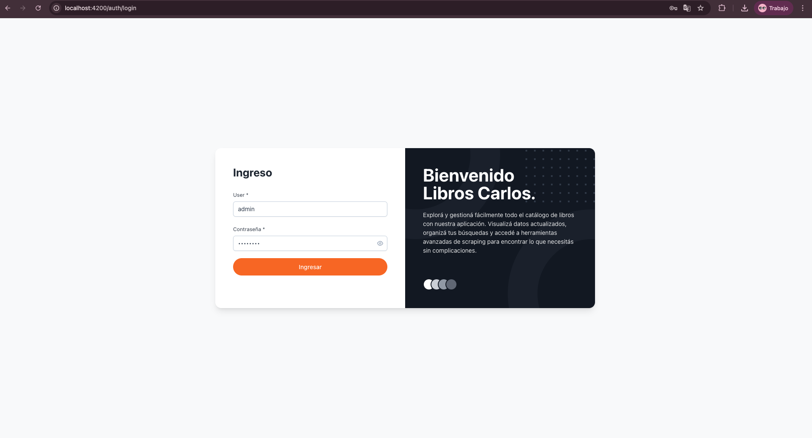
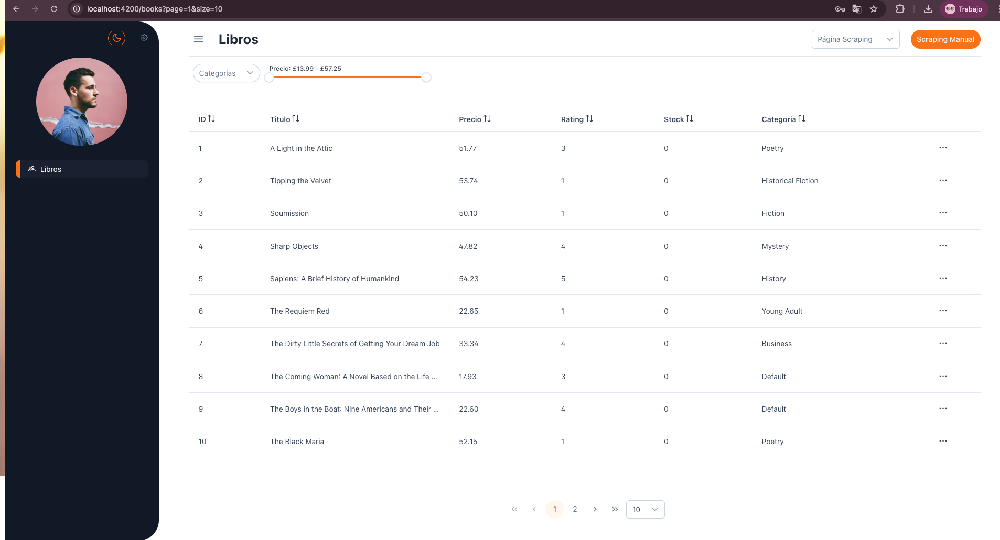

# 📚 Book Scraper – Frontend

Este es el frontend de la aplicación Book Scraper, desarrollada con Angular 19, TailwindCSS y PrimeNG. Su objetivo es consumir el backend para visualizar libros extraídos de páginas externas, con opciones de búsqueda y filtrado por autor o género.

## 🚀 Stack Tecnológico

- Angular 19
- TailwindCSS
- PrimeNG
- RxJS
- TypeScript
- Responsive (Mobile First)

## ⚙️ Instalación y ejecución

Clona el repositorio:

```bash
git clone https://github.com/CarlosAndresOrtega/FrontendLibros.git
cd FrontendLibros
```

Instala las dependencias:

```bash
npm install
```

Levanta el servidor de desarrollo:

```bash
npm run start
```

Accede en tu navegador a:

[http://localhost:4200](http://localhost:4200)

## 🌍 Variables de entorno

El archivo `src/environments/environment.ts` contiene la configuración base. Asegúrate de que el backend esté corriendo en el puerto correcto (por defecto: http://localhost:3000).

```ts
export const environment = {
  production: false,
  apiUrl: 'http://localhost:3000',
};
```

## 🧪 Pruebas

Para ejecutar las pruebas unitarias:

```bash
ng test
```

## 🧭 Navegación

El frontend está compuesto por las siguientes rutas:

| Ruta     | Descripción                |
|----------|----------------------------|
| /login   | Página de login            |
| /books   | Lista de libros con filtros|

## 🧩 Componentes clave

- `BooksPage`: página principal que muestra los libros.
- `AuthModule`: maneja autenticación (login).
- `BookCardComponent`: tarjeta reutilizable para cada libro.
- `BookService`: se encarga de consumir la API `/books`.

## 🗂️ Estructura del proyecto

```
book-scraper-front/
├── src/
│   ├── app/
│   │   ├── common/
│   │   │   └── components/        # Componentes reutilizables
│   │   ├── services/              # Servicios para API
│   │   ├── utils/                 # Helpers
│   │   ├── interceptors/          # Interceptores HTTP
│   │   ├── layout/                # Layout general
│   │   ├── pages/
│   │   │   ├── auth/              # Login
│   │   │   ├── books/             # Libros
│   │   ├── pages.routes.ts
│   ├── environments/
│   │   └── environment.ts
│   ├── app.component.ts
│   ├── app.routes.ts
│   ├── app.config.ts
│   ├── index.html
│   ├── main.ts
│   ├── styles.scss
│   ├── tailwind.css
├── angular.json
├── package.json
```
## 👤 Usuario

El usuario está agregado por defecto, pero por si alguna razón no aparece es:  
**User:** `Admin`  
**Password:** `Admin123`

> ⚠️ **Importante:** El usuario debe ser creado primero para poder ingresar.  
> Puedes crearlo desde Postman consumiendo el endpoint del backend.

## 📸 Captura





## ✍️ Autor

Carlos Andres Ortega Yate  
[https://github.com/CarlosAndresOrtega](https://github.com/CarlosAndresOrtega)
